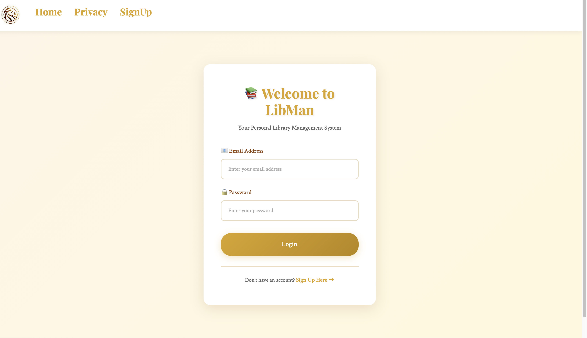
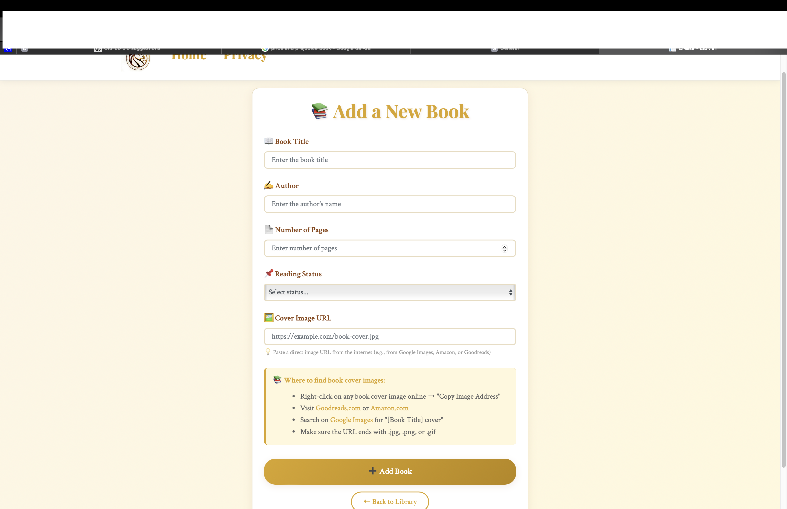

# LibMan - Library Management System

A web application for managing personal book collections, built with ASP.NET Core. Features a clean, elegant interface inspired by the New York Public Library aesthetic.


---

## Overview

LibMan is a personal library management system that helps users organize their book collections. It provides a straightforward way to track reading progress, store book information, and manage a personal library with an intuitive interface.

The application was developed as part of a university coursework project (CS382 - Fall 2020) and has been updated to work with modern .NET 9.0.

---

## Features

- **User Authentication**: Login and registration system with session management
- **Book Management**: Complete CRUD operations for books
- **Reading Status Tracking**: Organize books by status (To Read, Reading, Completed)
- **Cover Images**: Display book covers with URL-based image storage
- **Responsive Design**: Works across different screen sizes
- **Modern UI**: Clean design with smooth animations and transitions
- **Database**: SQLite database that creates automatically on first run

---

## Screenshots

### Login Page

*Centered login form with elegant design. Clean white card with golden accents, featuring email and password fields with a prominent login button.*

### Welcome/Dashboard

*Card-based grid layout displaying your personal book collection. Each book card shows the cover image, title, author, page count, reading status badge, and action buttons (Edit, Details, Delete).*

### Add Book

*Comprehensive form to add new books with helpful instructions. Features fields for title, author, pages, reading status dropdown, and cover image URL with preview functionality. Includes tips for finding book cover images online.*


---

## Tech Stack

- **Framework**: ASP.NET Core 9.0
- **Language**: C#
- **Database**: SQLite
- **ORM**: Entity Framework Core 9.0
- **Frontend**: 
  - Razor Pages
  - Bootstrap 4
  - Custom CSS with Google Fonts (Crimson Text, Playfair Display)
  - JavaScript for interactive features
- **Authentication**: Cookie-based authentication with sessions

### Dependencies
- `Microsoft.EntityFrameworkCore.Sqlite` (9.0.0)
- `Microsoft.EntityFrameworkCore.SqlServer` (9.0.0)
- `Microsoft.EntityFrameworkCore.Tools` (9.0.0)
- `Microsoft.VisualStudio.Web.CodeGeneration.Design` (9.0.0)

---

## Prerequisites

Before running this project, ensure you have:

- [.NET 9.0 SDK](https://dotnet.microsoft.com/download/dotnet/9.0) or later
- A code editor (Visual Studio, VS Code, or Rider)
- Git (for cloning the repository)

---

## How to Run

### 1. Clone the Repository

```bash
git clone https://github.com/yourusername/libman.git
cd libman
```

> **Note**: Replace `yourusername` with your actual GitHub username

### 2. Navigate to Project Directory

```bash
cd LibMan/LibMan
```

### 3. Restore Dependencies

```bash
dotnet restore
```

### 4. Build the Project

```bash
dotnet build
```

### 5. Run the Application

```bash
dotnet run
```

The application will start on:
- **HTTP**: `http://localhost:7000`
- **HTTPS**: `https://localhost:7001`

### 6. Access the Application

Open your browser and navigate to:
```
http://localhost:7000
```

The SQLite database (`Library.db`) will be created automatically in the project directory on first run.

---

## Project Structure

```
LibMan/
├── LibMan/
│   ├── Models/
│   │   └── DB/
│   │       ├── Books.cs
│   │       ├── User.cs
│   │       └── LibraryContext.cs
│   ├── Pages/
│   │   ├── Index.cshtml          # Login page
│   │   ├── SignUp.cshtml         # Registration page
│   │   ├── Welcome.cshtml        # Dashboard/Book list
│   │   ├── Create.cshtml         # Add new book
│   │   ├── Edit.cshtml           # Edit book
│   │   ├── Details.cshtml        # Book details
│   │   ├── Delete.cshtml         # Delete confirmation
│   │   └── Shared/
│   │       ├── _Layout.cshtml
│   │       └── _LayoutLogin.cshtml
│   ├── wwwroot/
│   │   ├── css/
│   │   │   └── site.css         # Custom styles
│   │   ├── js/
│   │   └── images/
│   ├── Startup.cs
│   ├── Program.cs
│   └── appsettings.json
└── README.md
```

---

## Design Features

The interface draws inspiration from the New York Public Library's classic aesthetic:

- **Color Scheme**: 
  - Cream background (#FDF5E6)
  - Golden accents (#DAA520)
  - Warm browns and beiges for text
- **Typography**: 
  - Headings: Playfair Display (elegant serif)
  - Body: Crimson Text (readable serif)
- **Components**:
  - Card-based layouts for book display
  - Smooth hover animations
  - Gradient buttons
  - Color-coded status badges
  - Responsive grid system

---

## Usage

1. **Sign Up**: Create a new account with your email, name, and password
2. **Login**: Use your credentials to access your library
3. **Add Books**: Click "Add New Book" to add books to your collection
4. **Manage Books**: View, edit, or delete books from your library
5. **Track Progress**: Update reading status as you progress through books

---

## Known Limitations & Future Improvements

- Password hashing for enhanced security (currently stored as plain text)
- Book search and filtering functionality
- Book categories/genres
- Reading statistics and analytics
- Export library to CSV/PDF
- Book recommendations based on collection

---

## About This Project

This project was created as part of **CS382 - Web Programming** coursework (Fall 2020). It demonstrates:

- Full-stack web development with ASP.NET Core
- Database design and Entity Framework Core
- User authentication and session management
- Modern UI/UX design principles
- Software engineering best practices

  
**Course**: CS382  
**Semester**: Fall 2020

---

## Repository Tags

`university-project` `old-project` `coursework` `asp-net-core` `csharp` `sqlite` `library-management` `web-application` `razor-pages` `entity-framework`

---

## Acknowledgments

- Design inspiration from the New York Public Library
- Typography provided by Google Fonts
- UI components from Bootstrap
- Built with ASP.NET Core framework

---

## License

This project was created for educational purposes as part of a university course. The codebase has been updated to work with .NET 9.0 and modern development practices while maintaining the original functionality.
